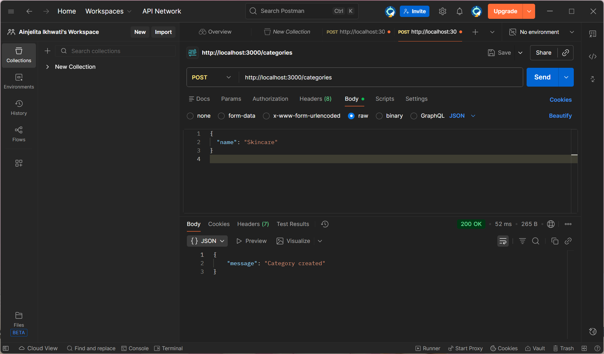
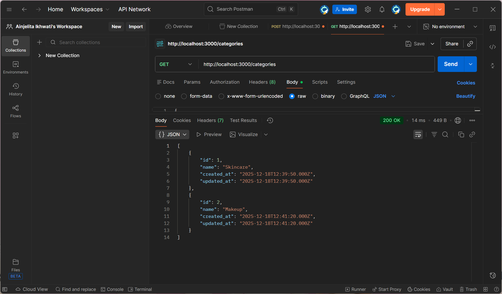
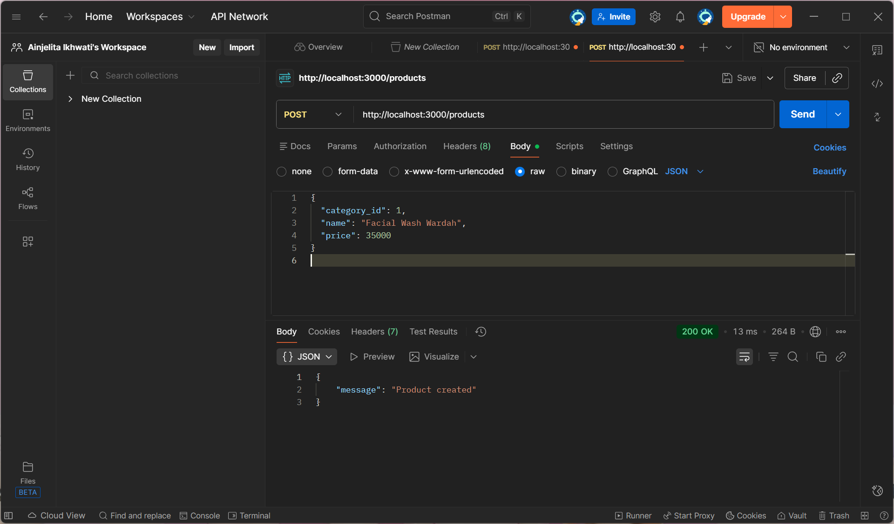
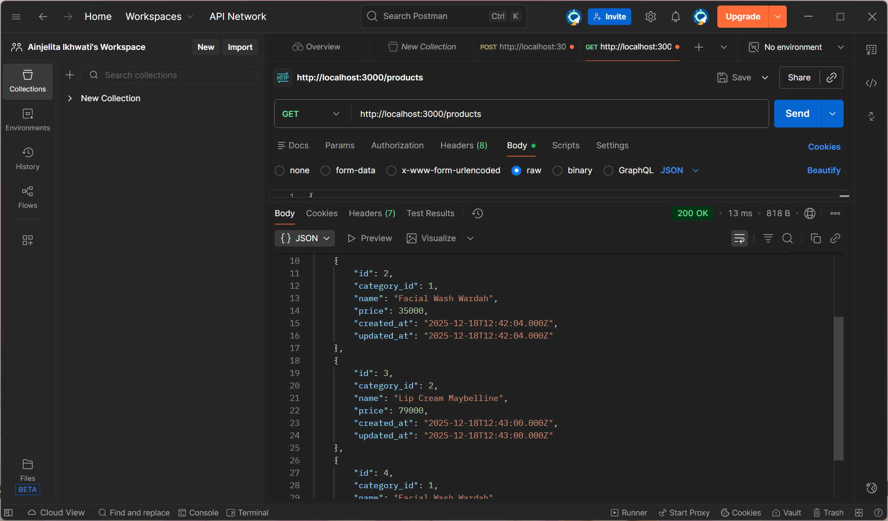
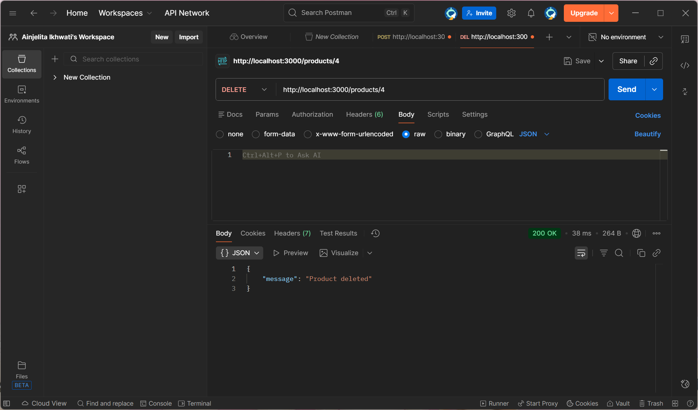

# CRUD REST API Toko Kecantikan

Project ini merupakan REST API sederhana menggunakan Node.js dan Express.js
untuk mengelola data kategori dan produk pada toko kecantikan.

## Fitur
- CRUD Categories (Skincare, Makeup, dll)
- CRUD Products (Facial Wash, Lip Cream, dll)
- Database MySQL
- Response menggunakan format JSON

## Cara Menjalankan
1. npm install
2. npm start
3. Server berjalan di http://localhost:3000

## Endpoint
- /categories
- /products

## Screenshot Uji Coba API

### Create Category

### Get Categories

### Create Product

### Get Products

### Delete Product

